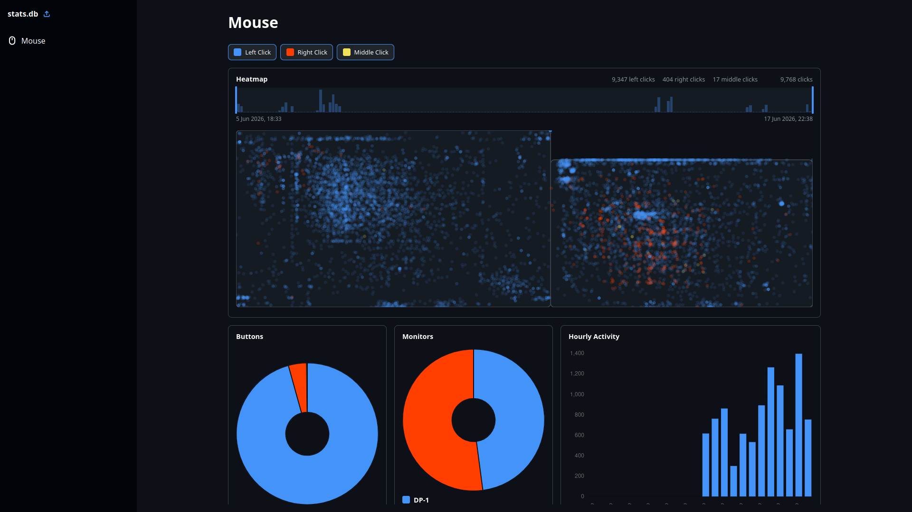
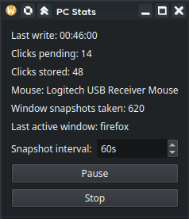

# PC Stats



PC Stats records mouse click activity on Linux and visualises it in a browser dashboard. The collector runs locally, writes click and monitor data to a SQLite database, and the dashboard reads that database to show heatmaps and charts.

## What It Tracks

- Mouse click position across all detected monitors
- Click timestamp
- Click button: left, right, or middle
- Current monitor layout and monitor names

The collector writes data to:

```bash
~/.local/share/pc-stats/stats.db
```

The database contains:

- `clicks(id, timestamp, x, y, button)`
- `monitors(id, name, x, y, width, height)`

## Dashboard - `dashboard/`

The hosted dashboard is available at:

```text
https://pc-stats.dubbyy.com
```

Use **Import Data** and select your `stats.db` file. An example database is included at:

```text
examples/stats.db
```

The dashboard currently includes:

- Click heatmap
- Timeline filtering
- Button filtering
- Button breakdown chart
- Monitor breakdown chart
- Hourly activity chart
- Daily activity chart

### Running The Dashboard Locally

From the `dashboard` directory:

```bash
npm install
npm run dev
```

Build the static dashboard with:

```bash
npm run build
```

The static build is written to:

```bash
dashboard/build
```

## Collector - `collector/`



The collector runs in the background to collect the data. It also has a small status window.

### Platform Support

Due to the low-level nature of the input monitoring, the collector is Linux only.

| Platform | Status |
|---|---|
| KDE Wayland | Supported |
| X11 | Supported |
| GNOME Wayland | Partial |
| Hyprland | Partial |
| Other | Unsupported |

### First-Time Setup

The collector needs permission to read input devices. Add your user to the `input` group:

```bash
sudo usermod -aG input $USER
```

Log out and back in after running that command.

Some systems may also require `python-xlib` and Qt/PySide runtime dependencies for source builds.

### Running From Source

Clone the repository and install collector dependencies:

```bash
git clone https://github.com/dubbyy1/pc-stats.git
cd pc-stats/collector
python -m venv .venv
source .venv/bin/activate
pip install -r requirements.txt
python main.py
```

### Building The Collector

From the `collector` directory:

```bash
source .venv/bin/activate
pip install pyinstaller
pyinstaller main.py --onefile --name pc-stats
```

The binary will be created at:

```bash
collector/dist/pc-stats
```

Run it with:

```bash
./dist/pc-stats
```
